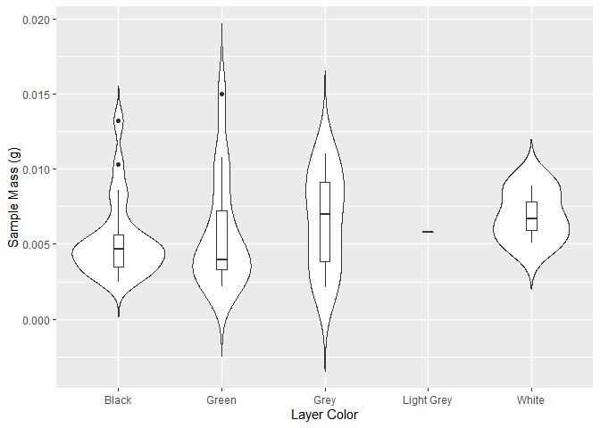

Homework 4
================
Jake Perez

## Using ggplot to visualize data

The `tidyverse` package includes functions that are great for data
visualization, such as `ggplot`.

``` r
library(tidyverse)
```

``` r
my_data <- read_csv('iron_raw_data_04.csv')
```

    Rows: 50 Columns: 4
    -- Column specification --------------------------------------------------------
    Delimiter: ","
    chr (2): core, color
    dbl (2): depth, sample_mass

    i Use `spec()` to retrieve the full column specification for this data.
    i Specify the column types or set `show_col_types = FALSE` to quiet this message.

We can now use ggplot to make a custom figure. We can use the following
code block to create a violin plot of sediment layer color with the mass
of the sample used for analyses.

``` r
ggplot(my_data) +
  geom_violin(aes(x = color, y = sample_mass), trim = FALSE) + 
  geom_boxplot(aes(x = color, y = sample_mass), width = 0.1) + 
  xlab("Layer Color") + ylab("Sample Mass (g)")
```

    Warning: Groups with fewer than two data points have been dropped.



The violin plot is envoked with the `geom_violin()` function and writing
`trim = FALSE` puts the tails on the ends of the plot. A warning is
given due to the Light Grey Category having only one sample represented
in the data set and therefore `ggplot` does not produce a violin graph.

We can also layer additional graphs to the figure, such as a
box-and-whisker plot to show additional statistical data like the sample
medians and quartiles. This is done using the `geom_boxplot()` function.
We specify the `width` parameter here to make the boxplot fit within the
violin plot.

To make the axes more descriptive than the data frame column headers, we
can write the labels using the `xlab()` and `ylab()` functions.

This is a good representation of the following data because it shows how
sample mass was distributed for each sediment layer color type because
the geochemical analyses that follow afterwards may be impacted by how
large the sample mass was. Therefore, it is a preliminary step to
determine if accounting for that impact may non-uniformly affect our
color categories.
