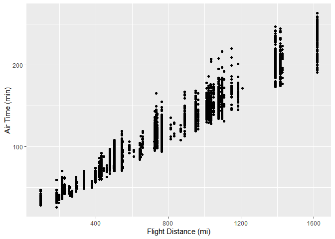
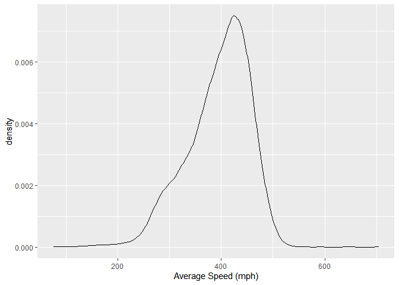
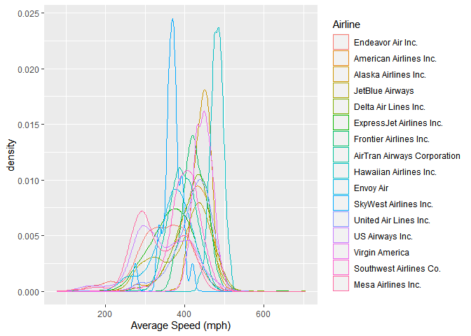

# Homework 5

Jake Perez

## Installing data packages

The following exercises will utilize the dataset `flights` that is loaded with the `nycflights13` package. I will also utilize various features with the `tidyverse` package.

``` r
library(tidyverse)
library(nycflights13)
```

# Question 1: filtering

The `flights` data frame is an extensive data set. We can utilize the `filter` function to select specific rows that mean one or more criteria. Let's say we only want to look at data values that correspond to the following:

-   originate from LaGuardia airport ("LGA")
-   departed on the 16th of the month
-   have a flight distance of less than 2000

We can filter these rows out by using a sequence of logical operators (e.g. `==` is "equals to" and `<` is "less than") and we can apply multiple filters by stringing them together `&` which indicates AND. We store this filtered data set into a new data frame `flights_filt`.

Now we can plot the data for this subset of data using `ggplot` for the air time as a function of distance:

``` r
flights_filt <- filter(flights, origin == "LGA" & day == 16 & distance < 2000)
ggplot(flights_filt, aes(x = distance, y = air_time)) +
  geom_point() +
  xlab("Flight Distance (mi)") + ylab("Air Time (min)")
```

    Warning: Removed 75 rows containing missing values (geom_point).


Note that there is a Warning message that `geom_point` removed some data points due to missing values (i.e. were `NA`).

# Question 2: dealing with NAs

We can selectively remove rows that possess `NA` values for certain data types. The `is.na()` returns either `TRUE` or `FALSE` depending whether the value within the parentheses is `NA`. We can check whether the arrival times or departure times are `NA` by using `is.na()` with the corresponding column headers and using the OR operator `|`. This will identify all rows that `NA` in either the arrival time or departure time columns. Since we want only the rows without `NA` in either column, we can use the `!` to identify only the rows with data values in both columns.

``` r
flights_noNA <- filter(flights, !(is.na(arr_time)|is.na(dep_time)))
```

## filtering NAs

`ggplot()` will automatically remove NA values from the plot, as you may have seen in question 1, but it emits a warning message about that. Of course you could silence the warning message using [chunk options](https://bookdown.org/yihui/rmarkdown-cookbook/chunk-options.html), but how could you prevent them from appearing in the first place?

Despite filtering certain columns, you can see below that there may still be data points that have missing values. You can address this in multiple ways.

``` r
flights_filt_NA <- filter(flights_noNA, origin == "LGA" & day == 16 & distance < 2000)
ggplot(flights_filt_NA, aes(x = distance, y = air_time)) +
  geom_point() +
  xlab("Flight Distance (mi)") + ylab("Air Time (min)")
```

    Warning: Removed 5 rows containing missing values (geom_point).



You can actively remove any data points that possess any `NA` values using the `na.omit()` function.

``` r
#Using na.omit() to clean up NA values in dataframe
flights_omit <- na.omit(flights_filt)
ggplot(flights_omit, aes(x = distance, y = air_time)) +
  geom_point() +
  xlab("Flight Distance (mi)") + ylab("Air Time (min)")
```


You can also passively omit the `NA` data points without removing them from the data set by using the `na.rm` parameter within the `geom` function and setting it to `TRUE`. This removes the warning without altering the data set.

``` r
#Using na.rm to omit NA values in plot
ggplot(flights_filt, aes(x = distance, y = air_time)) +
  geom_point(na.rm = TRUE) +
  xlab("Flight Distance (mi)") + ylab("Air Time (min)")
```


Which you choose may depend on how much you care to preserve incomplete data sets.

# Question 3: adding columns

We can use `filter()` and `NA`-handling to cleanly manipulate our data. To create a calculated value for each of our data points, say an average flight speed, we can use `mutate()` to perform the calculation for us and attach it to the data frame.

We can visualize this calculated column by using a `geom_histogram()` or `geom_density()`.

``` r
#Clean out data rows that may have NA values for columns used in calculations
flights_clean <- filter(flights, !(is.na(air_time)|is.na(distance)))

#Add a calculated column of average speed
flights_clean <- mutate(flights_clean,
       avg_speed = distance / air_time * 60) #speed in mph


ggplot(flights_clean, aes(x=avg_speed)) + 
  geom_density() + 
  xlab("Average Speed (mph)")
```



We can even break this out into different groups, like by airline.

``` r
ggplot(flights_clean, aes(x = avg_speed, color = carrier)) + 
  geom_density() + 
  scale_color_discrete(name = "Airline", labels = airlines$name) +
  xlab("Average Speed (mph)")
```


