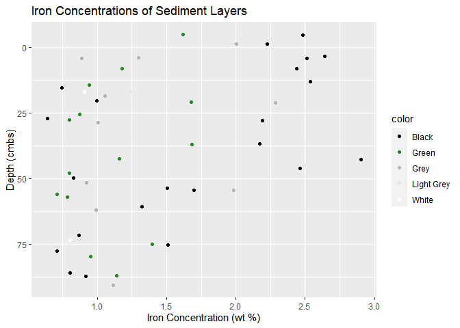
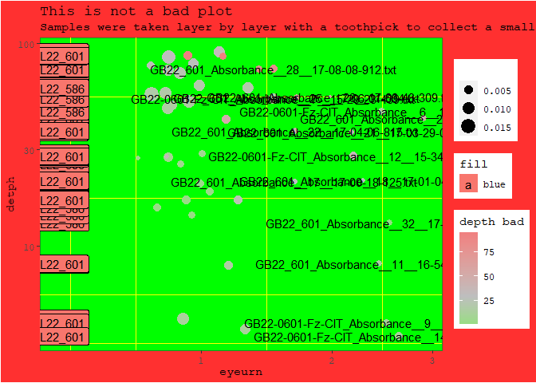

# Homework 6

Jake Perez

## Creating an absolute heinous plot

The purpose of this document is to demonstrate an understanding of what is a good plot through violating as many understood rules in data visualization. The data set used are results from an iron assay of sediment samples. This data was pre-processed within a different R script. This exercise will also work to keep within the functions of base R and `tidyverse`.

``` r
library(tidyverse)
df <- read.csv("iron_analysis_processed.csv")
```

We can present this data reasonably at first as a scatterplot to demonstrate the relationship between iron concentrations, depth, and sediment color:

``` r
ggplot(df, aes(x = wt_percent, y = depth_scaled, color = color)) +
  geom_point() + 
  scale_y_reverse() + 
  scale_color_manual(values = c("black", "forestgreen","grey70","grey90","white")) + 
  labs(title = "Iron Concentrations of Sediment Layers", x = "Iron Concentration (wt %)", y = "Depth (cmbs)")
```



While there could be some enhancements to the message of this plot, it gets the job done. It communicates a depth profile of sediment iron concentration while also layering an additional piece of information related to layer color. This plot helped identify a trend of black sediment layers having higher iron content in the upper sediment section relative to the other sediment layers.

``` r
ggplot(df) +
  geom_point(aes(x = wt_percent, y = depth_scaled, color = depth, size = sample_mass)) + 
  geom_label(aes(0.3, y = depth_scaled, label = core, fill = "blue")) +
  labs(title = "This is not a bad plot", 
       subtitle = "Samples were taken layer by layer with a toothpick to collect a small amount of sediment from just that layer. The sediment was then transferred to an epitube for iron extraction at a later time", 
       x = "eyeurn", 
       y = "detph") + 
  scale_color_gradient2(low = "green", 
                        mid = "grey", 
                        high = "lightcoral", 
                        midpoint = 30,
                        name = "depth bad") + 
  geom_text(aes(x = wt_percent, y = depth_scaled, 
                label = ifelse(wt_percent>1.5, as.character(spectral_file),''))) +
  theme(plot.background = element_rect(fill = "firebrick1"), 
        panel.background = element_rect(fill = "green", color = "forestgreen"), 
        panel.grid.major = element_blank(), 
        panel.grid.minor.x = element_line(color = "yellow"), 
        panel.grid.minor.y = element_line(color = "yellow"), 
        text = element_text(family = "mono")) + 
  scale_x_sqrt() + scale_y_log10() +
  scale_size_continuous(name = "")
```



So what are the offenses?

In no particular order of severity of crime:

-   A stylistic choice that is common with depth profiles is to invert the y-axis so that lower in the graph corresponds to lower in the core. I have ignored that practice here.

-   The data points encode a depth measurement into their color. This depth measurement is an pre-scaled value related to core compression. Since there are two cores present and the y-axis is a scaled depth measurement, they color does not even correspond to the axis. It is an aesthetic that only confuses the observer.

-   The color aesthetic is also presented as a divergent color gradient. Divergent color gradients are only best when you are interested in to whether your data is going in two different directions (e.g. positive and negative numbers, Wilke Chapter 4). This scale is only going in one direction (increasing depths) and there is no apparent numbers we’d like to compare to (besides 0). Additionally, the chosen ends of the color scale are very common colors to be indistinguishable for color-blind people. So some observers may not even know a color scale is present on the points.

-   The size aesthetic was also used to present information related to the mass of the sample used for analysis. This is less valuable to see in this form of a graph and even then the observer is less capable of distinguishing differences based on area (Healy Ch 1). Additionally, the observer is unable to know this is what is being encoded since the legend for it does not include any labeling.

-   I have added some additional labels to the points. On some of the points, particularly those of higher weight percent iron, I have listed the text file that contains the spectral data for that sample. These labels dominate the figure, obscure most points, and some are not clearly associated with a particular data point. It is irrelevant information to the observer and does a lot to damage the quality of the figure. The labels on the side are also containing information as to what core they come from. But they are on the side and overlapping. It is useless information. This also introduces another legend element that has absolute nonsense of information (Fill: red for “blue”)

-   Labels: The title is incorrect while also not relevant to the information plotted. The subtitle is excessive as it contains method details. This is not appropriate for a figure subtitle and more appropriate as a figure caption. It contributes to the violation of Tufte’s data-to-ink ratios. It adds more ink while not adding more data. Misspelling in the x- and y-labels.

-   Theme: The plot and panel backgrounds are obnoxiously colored and are very unappealing. It dominates the more muted data points. The lack of major gridlines make it difficult to anchor the values of the data points, a quality that Wilke emphasizes in Chapter 23. The minor gridlines are also yellow on a green background, thus hard to interpret and bear looking at. The font change is not the most heinous thing, but it certainly is not an easy to choice to look at given the coloring. I could’ve at least been kind enough to make it bold.

-   Scales: The x-axis is on a square-root scale and the y-axis is on a log10 scale. The square root scale is unnecessary since this scale is best for data that is square in nature (Wilke Ch. 3). The y-axis is a major issue as it causes some data to be omitted (some depths were negative as a product of the depth scaling of highly compressed cores).
