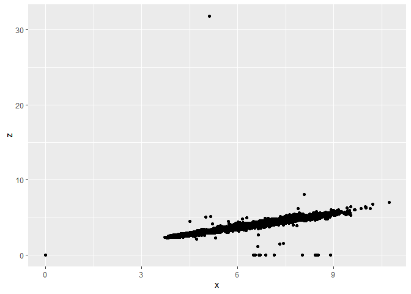
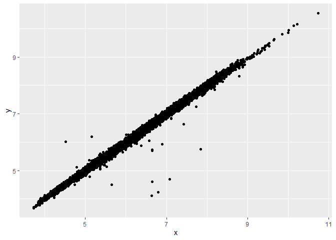
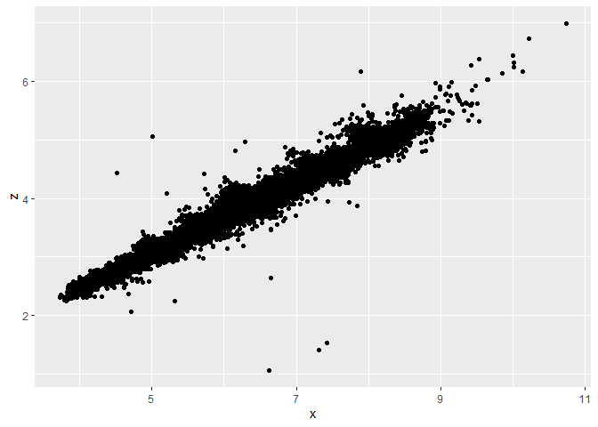
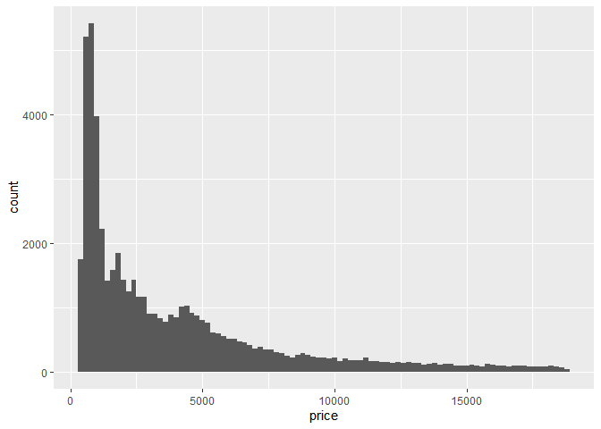
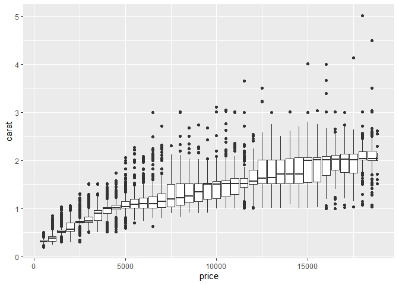
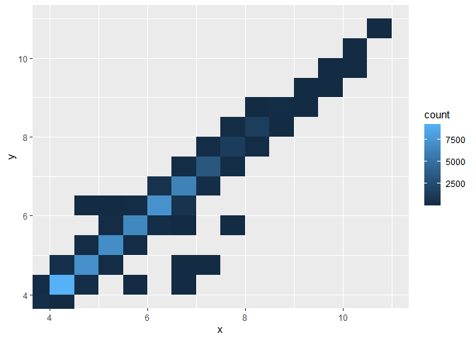

# Homework 7

Jake Perez

## Exploratory Data Analysis

``` r
library(tidyverse)
```

#### Question 1:

One of the measurements that I gravitated towards were the length (`x`), width (`y`), and depth (`z`) measurements within the `diamonds` dataset. We can explore the range of values by first plotting a few of them relative to each other.

``` r
ggplot(diamonds, aes(x = x, y = y)) +
  geom_point()
```


``` r
ggplot(diamonds, aes(x = x, y = z)) +
  geom_point()
```



There are some outlying values that appear very different from the trend. First, there are values that are zero. I do not think it is possible that a diamond was discovered to be two dimensional (and some cases are even less!). Then some dimensions are astonishingly higher than others. While maybe there are diamonds that are \~5 times larger in one direction than the other, let's filter this data out to remove either bad data or clear outliers.

``` r
#Create a cleaned up data frame based on reasonable ranges for size dimensions
clean <- diamonds %>%
  filter(x > 0 & x < 11 & y > 0 & y <15 & z > 0 & z < 10)

ggplot(clean, aes(x = x, y = y)) +
  geom_point()
```



``` r
ggplot(clean, aes(x = x, y = z)) +
  geom_point()
```



Based on the scatterplots, it is shown that the "bad data" has been filtered out. We can now see finer variations within the data set.

### 7.3.4.2

*Explore the distribution of `price`. Do you discover anything unusual or surprising? (Hint: Carefully think about the `binwidth` and make sure you try a wide range of values.)*

``` r
ggplot(diamonds, aes(x = price)) + 
  geom_histogram(binwidth = 200)
```



The price of the diamonds in the set are skewed. The distribution has more values to the cheaper end and tails off the expensive end. With large `binwidths` (like \>2000), the data looks like it consistently decreases. But with sufficiently small `binwidths` (ex. 200), the data shows a secondary hump just below 5000.

### 7.5.3.2

*Visualise the distribution of carat, partitioned by price.*

``` r
ggplot(clean, aes(x = price, y = carat)) + 
  geom_boxplot(aes(group = cut_width(price, 500)))
```



Overall, the carat of the diamond increases as the price increases but only increases very slowly at higher prices (i.e. it nearly maxes at 2). The distribution of the carat values are very tight in very low and very high priced diamonds, with numerous outliers. In the moderate price diamonds, the distribution becomes more dispersed, as visually seen with the width of the boxes. There also seems to be an envelope of values where above a certain value, the carat is never lower than 1, and at low costs the carat does not seem to exceed a roughly linear trend.

### 7.5.3.1.5

*Two dimensional plots reveal outliers that are not visible in one dimensional plots. For example, some points in the plot below have an unusual combination of `x` and `y` values, which makes the points outliers even though their `x` and `y` values appear normal when examined separately.*

    ggplot(data = diamonds) +
      geom_point(mapping = aes(x = x, y = y)) +
      coord_cartesian(xlim = c(4, 11), ylim = c(4, 11))


*Why is a scatterplot a better display than a binned plot for this case?*

Binning these values removes a level of resolution that is needed to identify outliers that are otherwise clearly identified by scatterplots. So small deviations from a general trend can quickly become lumped with acceptable data points. Also, the `diamonds` dataset if very large and has an overwhelming amount of data points that are not unusual. So identifying a few data points that fall off trend would be imperceptible on a 2D bin plot because the scale would be blown out towards high values.

``` r
ggplot(diamonds) +
  geom_bin2d(aes(x=x, y=y), binwidth = 0.5) +
  coord_cartesian(xlim = c(4, 11), ylim = c(4, 11))
```



As seen above, we could identify what range of values the outliers exist in, but the question is how many are there? How would we know if we cleared out all the bad data? The scatterplot shows that information more readily.
