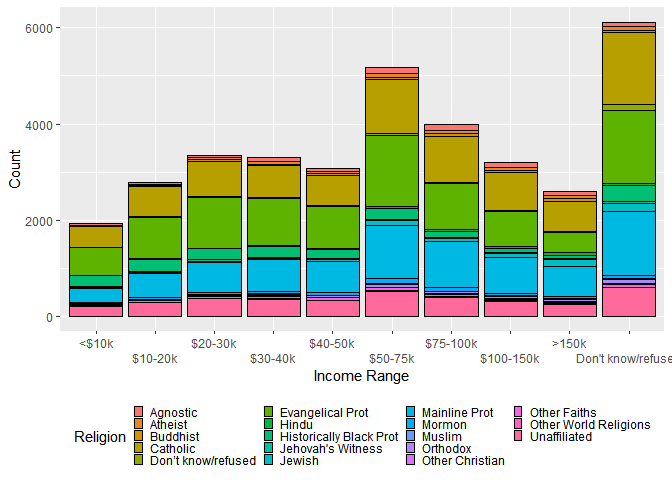

# HMK 8: summarising, reshaping, merging

Jake Perez

# Q1: Summarising operations and exploratory data analysis

``` r
library(tidyverse)
library(nycflights13)
```

## Q1a

I will use `group_by()` and `summarise()` to explore the dataset within `experiment1.csv`. The summary output is shown below.

``` r
d1 <- read_csv("experiment1.csv", show_col_types = FALSE) 

d1_sum <- d1 %>%
  group_by(balls) %>%
  summarise(n = n(),
            mean_x = mean(x),
            sd_x = sd(x),
            mean_y = mean(y),
            sd_y = sd(y))

d1_sum
```

    # A tibble: 4 x 6
      balls     n mean_x  sd_x mean_y  sd_y
      <dbl> <int>  <dbl> <dbl>  <dbl> <dbl>
    1     1    11      9  3.32   7.50  2.03
    2     2    11      9  3.32   7.50  2.03
    3     3    11      9  3.32   7.5   2.03
    4     4    11      9  3.32   7.50  2.03

The different groups (`balls` with values `1`, `2`, `3`, and `4`) have the same number of observations, mean and standard deviations for `x`. The mean and standard deviations of `y` are nearly identical with very small differences within the thousandths or tens thousandths places. In other words, these groups are nearly identical statistically.

## Q1b

I will repeat this process with a second dataset in `experiment2.csv`.

``` r
d2 <- read_csv("experiment2.csv", show_col_types = FALSE)

d2_sum <- d2 %>%
  group_by(dataset) %>%
  summarise(n = n(),
            mean_x = mean(x),
            sd_x = sd(x),
            mean_y = mean(y),
            sd_y = sd(y))

d2_sum
```

    # A tibble: 13 x 6
       dataset        n mean_x  sd_x mean_y  sd_y
       <chr>      <int>  <dbl> <dbl>  <dbl> <dbl>
     1 away         142   54.3  16.8   47.8  26.9
     2 bullseye     142   54.3  16.8   47.8  26.9
     3 circle       142   54.3  16.8   47.8  26.9
     4 dino         142   54.3  16.8   47.8  26.9
     5 dots         142   54.3  16.8   47.8  26.9
     6 h_lines      142   54.3  16.8   47.8  26.9
     7 high_lines   142   54.3  16.8   47.8  26.9
     8 slant_down   142   54.3  16.8   47.8  26.9
     9 slant_up     142   54.3  16.8   47.8  26.9
    10 star         142   54.3  16.8   47.8  26.9
    11 v_lines      142   54.3  16.8   47.8  26.9
    12 wide_lines   142   54.3  16.8   47.8  26.9
    13 x_shape      142   54.3  16.8   47.8  26.9

There are many more groups within this dataset. The number of observations within each group is the same. The mean and standard deviations of both `x` and `y` appear to have more variation within the hundredths and thousandths place.

# Q2: pivoting

We can explore the relationship between income and various religion by using the `relig_income` data set. I used `pivot_longer()` to adjust the data structure into a a more appropriate format to best use aesthetics and grouping to feed into `ggplot`.

We can then use a bar graph to to see the number of people with different income ranges by religion.

``` r
d3 <- relig_income %>%
  pivot_longer(!religion, names_to = "income", values_to = "count") %>%
  group_by(religion)

d3$income <- factor(d3$income, levels = c("<$10k", "$10-20k", "$20-30k", "$30-40k", "$40-50k", "$50-75k", "$75-100k", "$100-150k", ">150k", "Don't know/refused"))

ggplot(d3, aes(x = income, y = count, fill = religion)) +
  geom_col(color = "black") +
  scale_x_discrete(guide = guide_axis(n.dodge=2)) +
  labs(x = "Income Range", y = "Count", fill = "Religion") +
  guides(fill=guide_legend(ncol=4)) +
  theme(legend.position = "bottom", legend.key.size = unit(0.5, "lines"))
```



# Q3: merging

## Q3a: meaning of joins

Explain the difference between a left join, a right join, an inner join, and an outer join.

Left join will look at two data sets and preserve all objects on the left data set and join the values of right data set that match to objects in the left data set. Objects in the right data set but not in the left data set are removed from the joined data set.

Right join will do the similar thing but preserve the right data set, join data from the left data set that is matched to the right data set, and remove objects in the left data set that are not present in the right.

Inner join will preserve objects that are in both left and right data sets but remove objects that are not in both.

Outer join will preserve all objects that are in either data sets.

## Q3b: using joins

We can observe potential relationships between departure delays and weather patterns by combing the `flights` and `weather` data sets using various joining functions. Here, I first mutated the `dep_time` into an integer by using integer division `%/%` to extract the hour. This will allow a smooth `left_join()` by matching `origin`, `year`, `month`, and `hour`. All other data in `flights` was removed for cleanliness.

``` r
#Store flights and weather into different dataframe objects
f <- flights
w <- weather
#Store the hour of the departure time into hour
f <- f %>%
  mutate(hour = dep_time %/% 100) %>%
  select(origin, year, month, day, hour, dep_delay)

fw <- left_join(f, w)
```

    Joining, by = c("origin", "year", "month", "day", "hour")

We can see if there is a relationship between departure delay and wind speed by developing a linear model with `lm()`. From the summary, there is a strong statistical relationship between the two. The `geom_smooth()` figure shows the strength of the linear model.

``` r
m <- lm(dep_delay ~ wind_speed, data = fw)
summary(m)
```

    Call:
    lm(formula = dep_delay ~ wind_speed, data = fw)

    Residuals:
        Min      1Q  Median      3Q     Max 
     -56.40  -17.55  -14.09   -1.95 1289.78 

    Coefficients:
                Estimate Std. Error t value Pr(>|t|)    
    (Intercept) 11.22028    0.15658   71.66   <2e-16 ***
    wind_speed   0.12649    0.01274    9.93   <2e-16 ***
    ---
    Signif. codes:  0 '***' 0.001 '**' 0.01 '*' 0.05 '.' 0.1 ' ' 1

    Residual standard error: 40.17 on 326852 degrees of freedom
      (9922 observations deleted due to missingness)
    Multiple R-squared:  0.0003016, Adjusted R-squared:  0.0002985 
    F-statistic: 98.61 on 1 and 326852 DF,  p-value: < 2.2e-16

``` r
ggplot(fw, aes(wind_speed, dep_delay)) +
  geom_smooth(method = "lm") +
  labs(x = "Wind Speed (mph)", y = "Departure Delay (min)")
```

    `geom_smooth()` using formula 'y ~ x'

    Warning: Removed 9922 rows containing non-finite values (stat_smooth).


